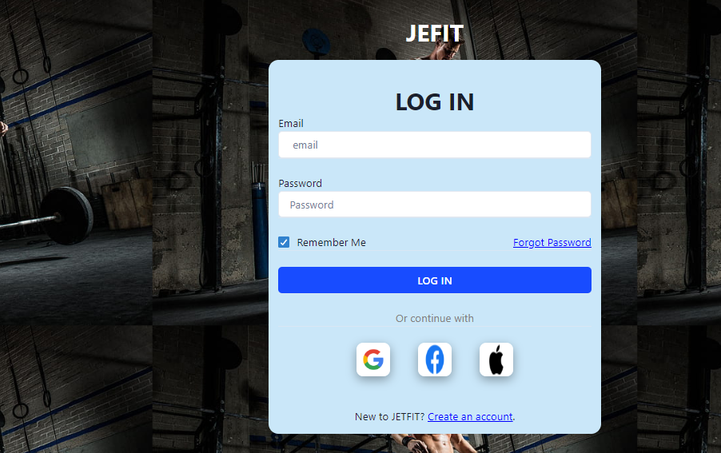
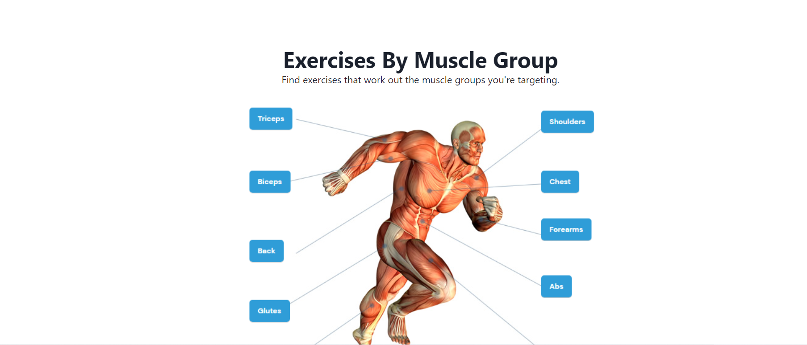
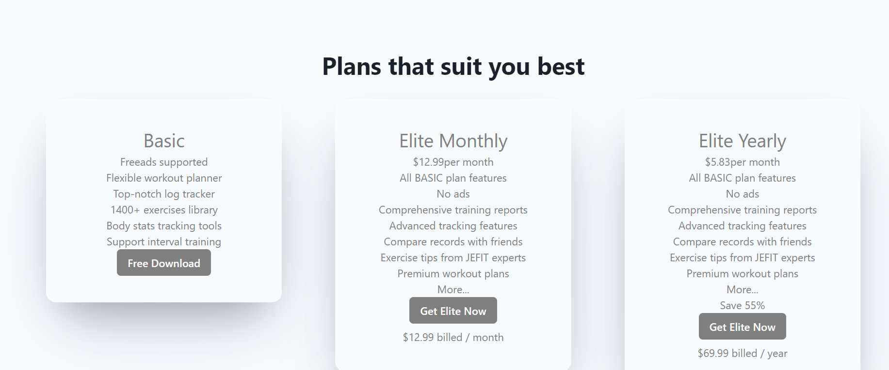

## JEFIT 

## Badges

This is body Exercise Website. JEFIT, the number one workout tracking and planning app, provides a free fitness program database to help you stay fit, make progress and get the most out of your gym or home fitness sessions.

## Technologies we used

- HTML
- CSS
- JAVASCRIPT
- Browser LocalStorage
- React
- Chakra UI

## Features

- There is login and logout functionality.
- Elegant navbar for easy navigation between pages and categories.
- Customers can view the Excercise list of a particular category.

## Screenshots
A glimpse of our website

- On this page users can signup/sign-in based on whether the user is already registered or not.

Step :- 1

Step :- 2

- The landing page.

Step :- 1

- The list of Excercise

- on the checkout page,  address and credit card details in order to place the order.

Step :- 1

- There is footer page where the user see terms and condition and connected to our social sites

 [Demo link here](https://633989a129322c53d320550a--the-great-niteshsindhu-site.netlify.app/) 

## Author

- [Nitesh Sindhu](https://github.com/NiteshSindhu)